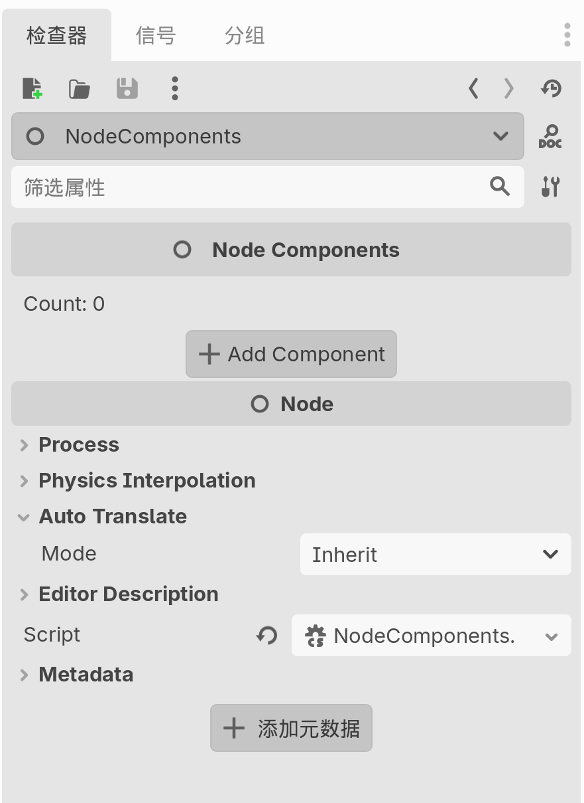
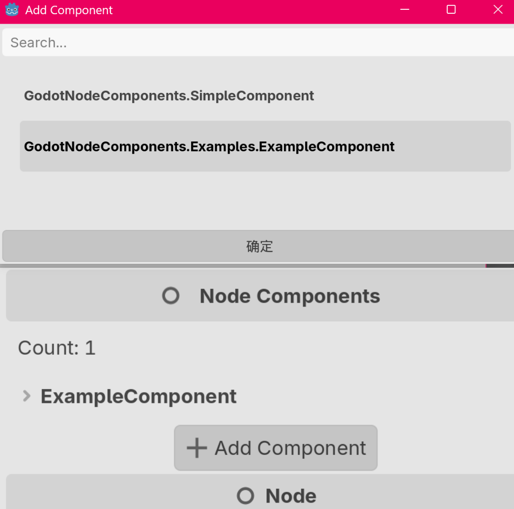

## Godot Node Components

一个 Godot 的 C# 插件，使一个 Node 可以挂多个 Component 脚本。

[English](./README.md)


### Godot 版本

- Godot_v4.6-beta1_mono


### 快速开始

将 `NodeComponents` 组件附加到 Node 节点，点击 Add Component，选择要附加的组件，点击确定

<p>
    
    
</p>

`ExampleComponent` 示例组件实现：

```csharp
public class ExampleComponent : BaseComponent
{
    public override void Awake()
    {
        GD.Print("ExampleComponent Awake: " + Owner.Name);
    }

    public override void Start()
    {
        GD.Print("ExampleComponent Start: " + Owner.Name);
    }

    public override void Update(double delta)
    {

    }
}
```

使用其他节点时，如 `Node3D`，要对应使用 `Node3DComponents`，目前仅实现了 `NodeComponents`、`Node2DComponents`、`Node3DComponents`、`ControlComponents`

需要更多类型可以自己继承对应的 class 实现（Godot 使用基类挂载到 Node，无法访问原始 Node 的类型，[详情查看](https://github.com/godotengine/godot/issues/11980)），如 `Sprite2D`：

```csharp
[Tool]
public partial class Sprite2DComponents : Sprite2D, IComponents
{
    public ComponentsController Components { get; set; }

    public Sprite2DComponents()
    {
        if (Components == null)
            Components = new ComponentsController();
        Components.Initialize(this);
    }

    public override void _EnterTree()
    {
        Components.EnterTree();
    }

    public override void _ExitTree()
    {
        Components.ExitTree();
    }

    public override void _Ready()
    {
        Components.Ready();
    }

    public override void _Process(double delta)
    {
        Components.Process(delta);
    }

    public override void _PhysicsProcess(double delta)
    {
        Components.PhysicsProcess(delta);
    }

    protected override void Dispose(bool disposing)
    {
        Components.Dispose();
        Components = null;
    }

    public void SaveComponents(string[] data)
    {
        this.SaveComponentsToMeta(data);
    }

    public string[] LoadComponents()
    {
        return this.LoadComponentsFromMeta();
    }
}
```

### 如何实现的？

将 Components 数据序列化为 Json 保存在 string[] 中，然后存储在节点的 Meta 元数据中，在运行时还原。

```csharp
public static void SaveComponentsToMeta(this Node node, string[] data)
{
    node.SetMeta(ComponentsConfig.ComponentsMetaKey, data);
}
```

### 尚未完成的

- 组件的字段还不能在 Inspector 中编辑
- 重新编译后，Godot 的插件因为一些匿名 Callback，总会报出一些奇怪的 Error，暂不影响运行
